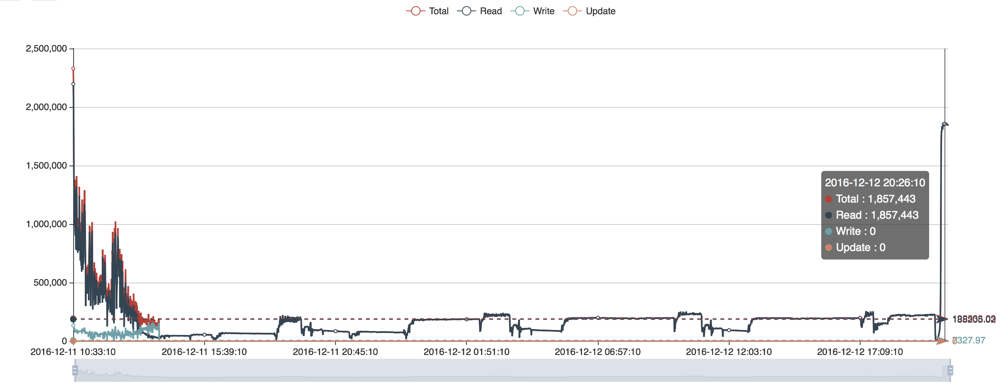
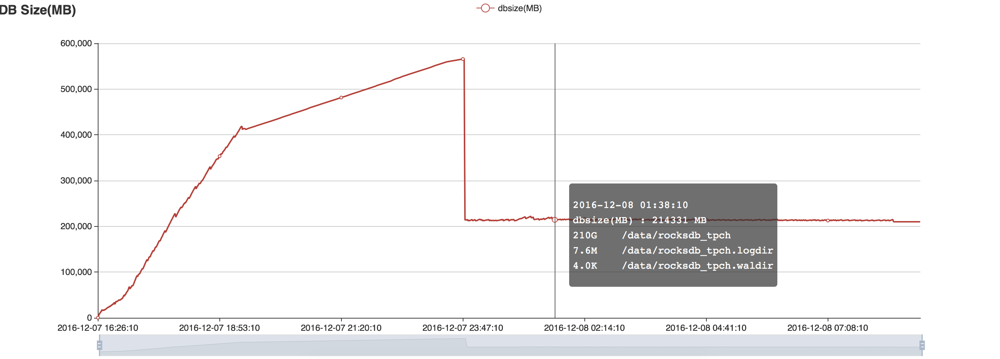
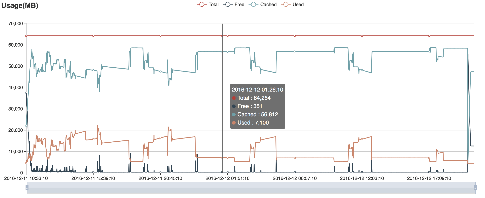
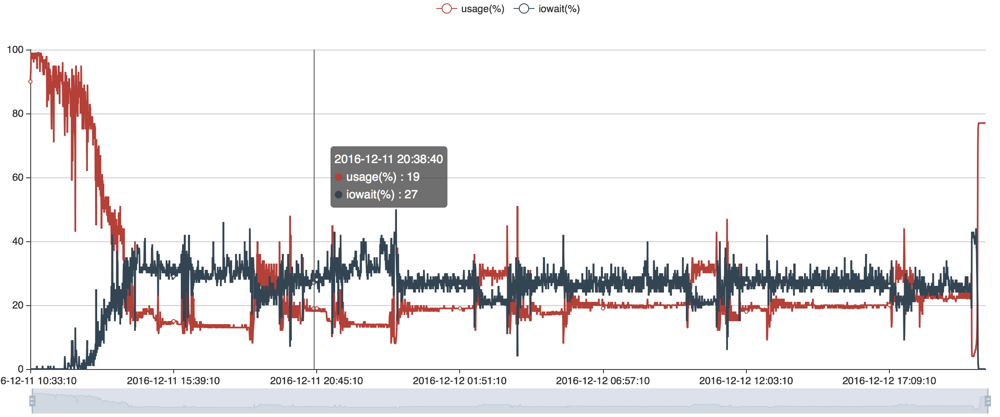

# TerarkDB vs. RocksDB on Server A

## 1. Test Dataset

We use the lineitem table in TPC-H dataset, and set the length of comment text field in the dbgen lineitem to 512 (from 27). So the average row length of the lineitem table is 615 bytes, in which, the key is the combination of the first 3 fields printed into decimal string from integers.

The total size of the dataset is `554,539,419,806 bytes`, with `897,617,396 lines`. The total size of the keys is `22,726,405,004 bytes`, the other part is values.

TPC-H dbgen generates raw data of strings, which we use directly in our test, without any transformation on the data.

## 2. Hardware
|                                                                    | Server A                                  |
|--------------------------------------------------------------------|-------------------------------------------|
| CPU Number                                                         | 2                                         |
| CPU Type                                                           | Xeon E5-2680 v3                           |
| CPU Freq.                                                          | 2.5 GHz                                   |
| CPU Actual Freq.                                                   | 2.5 GHz                                   |
| Cores per CPU                                                      | 8 cores with 16 threads                   |
| Cores in total                                                     | 16 cores 32 threads                       |
| CPU Cache                                                          | 30M                                       |
| [CPU bogomips](http://www.cnblogs.com/youngerchina/p/5624439.html) | 4988                                      |
| Memory                                                             | 64GB                                      |
| Memory Freq.                                                       | DDR4 2133Hz                               |
| SSD Capacity                                                       | 2TB x 1                                   |
| SSD IOPS                                                           | 20000  (Network virtual SSD, not local SSD) |

## 3. DB Parameters

|                                      | RocksDB                                                                                                                                                                                                                  | TerarkDB                              |
|--------------------------------------|--------------------------------------------------------------------------------------------------------------------------------------------------------------------------------------------------------------------------|---------------------------------------|
| Level Layers                         | 4                                                                                                                                                                                                                        | 4                                     |
| Compression                          | Level 0 doesn’t compress Level 1~3 use Snappy                                                                                                                                                                        | All level uses Terark Compression |
| Compact Type                         | Level based compaction                                                                                                                                                                                                   | Universal compaction                  |
| MemTable Size                        | 1G                                                                                                                                                                                                                       | 1G                                    |
| Cache Size                           | 16G                                                                                                                                                                                                                      | Do not need                           |
| MemTable Number                      | 3                                                                                                                                                                                                                        | 3                                     |
| Write Ahead Log                      | Disabled                                                                                                                                                                                                                 | Disabled                              |
| Compact Threads                      | 2~4                                                                                                                                                                                                                      | 2~4                                   |
| Flush Threads  (MemTable Compression) | 2                                                                                                                                                                                                                        | 2                                     |
| Terark Compress threads              | NA                                                                                                                                                                                                                       | 12                                    |
| Working Threads                      | 25 in total  24 Random Read, 1 Write                                                                                                                                                                                     | 25 in total  24 Random Read, 1 Write                       |
| Target_file_size_base                | Default (64M)                                                                                                                                                                                                            | 1G                                    |
| Target_file_size_multiplier          | 1 (SST size in RocksDB  do not influence performance)                                                                                                                                                                     | 5                                     |

For both of them, we disable all write speed limits:

- options.level0_slowdown_writes_trigger = 1000;
- options.level0_stop_writes_trigger = 1000;
- options.soft_pending_compaction_bytes_limit = 2ull<<40
- options.hard_pending_compaction_bytes_limit = 4ull<<40

## 4. Benchmark Charts
### 4.1. OPS Comparison
#### 4.1.1. TerarkDB OPS

#### 3.1.2. RocksDB OPS

### 4.2. DB Size Comparison
#### 4.2.1. TerarkDB DB Size

#### 4.2.2. RocksDB DB Size

### 4.3. Memory Usage Comparison
#### 4.3.1. TerarkDB Memory Usage

#### 4.3.2. RocksDB Memory Usage

### 4.4. CPU Usage Comparison
#### 4.4.1. TerarkDB CPU Usage

#### 4.4.2. RocksDB CPU Usage

## 5. Benchmark Detail Explaination

<table>
<tr>
  <td width="20%">&nbsp;</td>
  <td width="40%">RocksDB (DB Cache 16GB)</td>
  <td width="40%">TerarkDB</td>
</tr>
<tr>
  <td>0~2 minutes</td>
  <td>Read OPS 1M  Write OPS 140K  (Memory is enough)</td>
  <td>Read OPS 1.69M  Write OPS 120K  (Memory is enough)</td>
</tr>

<tr>
<td>2~15 minutes</td>
<td>Read OPS 690K  Write OPS 90K  (Compaction started,  memory pressure increases,  but still enough to use)</td>
<td>Read OPS 850K   Write OPS 80K  (Memory is enough)</td>
</tr>

<tr>
  <td>15~30 minutes</td>
  <td> Read OPS down to around 10K  Write OPS around 90K  (Memory runs out)
</td>
  <td>Read OPS fluctuates sharply between 500K~1M,  Write OPS around 60K.  
      CPU usage close to 100%, IOWait close to 0.  
      (Memory is sufficient, but the compression thread in the background starts to compete with the read threads.)</td>
</tr>

<tr>
<td>30~60 minutes</td>
<td>Read OPS declines all the time.  Write OPS around 110K</td>
<td>Read OPS fluctuates between 350K ~ 980K, with average 500K.CPU usage starts to go down. (Compaction thread hits the read performance)</td>
</tr>

<tr>
<td>60~120 minutes</td>
<td>Read OPS declines all the time.</td>
<td>Read OPS fluctuates sharply, with average 450K.
Write OPS keeps at around 55K.</td>
</tr>

<tr>
<td>170 minutes</td>
<td>550G data all written, with average write OPS 88K. SSD usage starts to decline.</td>
<td>&nbsp;</td>
</tr>

<tr>
<td>173 minutes</td>
<td>Read OPS declines to lower than 10K</td>
<td>&nbsp;</td>
</tr>

<tr>
<td>3 hours 30 minutes</td>
<td>&nbsp;</td>
<td>550G data finishes writing (The compression thread in the background impacts read performance greatly.)</td>
</tr>

<tr>
<td>3.5~11 hours</td>
<td>Read OPS declines to lower than 5000</td>
<td>Read OPS keeps at around 50K (Data being compressed gradually, more data can be loaded into memory)</td>
</tr>

<tr>
<td>8 hours 40 minutes</td>
<td>Full Compaction finishes, data size about 213GB</td>
<td>Read OPS increases to around 60K</td>
</tr>

<tr>
<td>11 hours</td>
<td>Read OPS keeps at around 3K (Data doesn’t fully fit in memory)</td>
<td>Read OPS grows and keeps at around 180K</td>
</tr>

<tr>
<td>>30 hours</td>
<td>&nbsp;</td>
<td>Data compression completes, Read OPS keeps at 1.85M (Compaction completes, data size is 47GB after compression, can be fully loaded into memory)</td>
</tr>

</table>